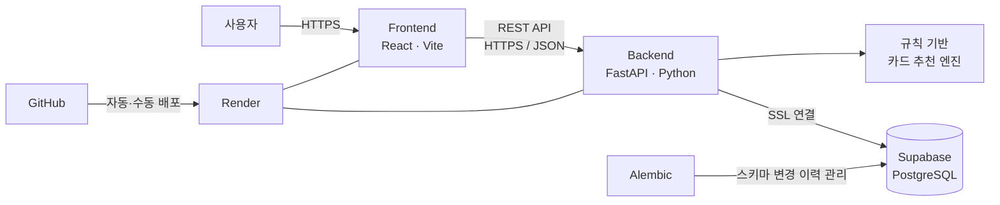

# PICKA — 나에게 맞는 카드를 고르는 가장 쉬운 방법

> 보유 카드의 혜택을 비교해 결제 상황에 가장 유리한 카드를 추천하고, 소비 기록을 바탕으로 새로운 카드까지 제안하는 모바일 카드 추천 서비스

🔗 **배포 서비스:** https://picka-frontend.onrender.com/

> PICKA의 결제 기능은 실제 금융망과 연결되지 않은 **프로젝트용 가상 결제(MVP)** 입니다.

## 1. 프로젝트 소개

카드마다 혜택 조건과 실적 구간이 달라 사용자가 결제할 때마다 가장 유리한 카드를 직접 판단하기는 어렵습니다. PICKA는 사용자의 보유 카드, 결제 금액, 결제처, 전월 실적과 혜택 조건을 함께 분석해 현재 결제에 적합한 카드를 추천합니다.

또한 결제 내역과 혜택 실적을 소비 리포트로 보여주고, 사용자의 소비 패턴과 자격 정보를 바탕으로 신규 카드도 추천합니다.

### 해결하려는 문제

- 카드 혜택 조건이 복잡해 실제 받을 수 있는 혜택을 알기 어려움
- 여러 카드를 보유한 경우 결제 순간에 어떤 카드를 써야 할지 판단하기 어려움
- 지난 소비에서 받은 혜택과 놓친 혜택을 한눈에 확인하기 어려움
- 신규 카드를 고를 때 상품 설명만으로 나에게 맞는지 비교하기 어려움

## 2. 주요 기능

### 회원 및 인증

- 회원가입, 로그인, 로그아웃
- Access Token과 Refresh Token을 이용한 인증 상태 유지
- 사용자 개인정보 및 카드 자격 정보 관리

### 모바일 카드 지갑

- 보유 카드 목록 및 카드 상세 정보 확인
- 카드별 실적, 혜택, 이용 내역 확인
- 새로운 카드 등록 및 보유 카드 관리

### 결제 상황별 보유 카드 추천

- QR을 통해 결제 상황 진입
- 가맹점과 결제 금액을 기준으로 보유 카드 혜택 계산
- 전월 실적, 혜택 한도, 제외 조건 등을 반영해 카드 순위 제공
- 추천 카드 선택 후 가상 결제 진행

### 소비 리포트

- 기간별 결제 금액과 받은 혜택 집계
- 카드별 이용 금액과 혜택 비교
- 소비 카테고리 및 결제 내역 확인
- 데모용 테스트 결제는 실제 사용자 통계에서 제외

### 신규 카드 추천

- 사용자의 실제 소비 패턴과 입력한 자격 정보 활용
- 카드별 예상 혜택 계산 및 추천 순위 제공
- 추천 이유와 예상 혜택, 카드 상세 조건 확인

## 3. 사용자 이용 흐름

```text
회원가입·로그인
      ↓
개인정보 및 카드 추천용 자격 정보 입력
      ↓
보유 카드 등록
      ↓
카드 지갑에서 실적과 혜택 확인
      ↓
QR 결제 상황 입력 → 최적 보유 카드 추천 → 가상 결제
      ↓
소비 리포트에서 결제 금액과 받은 혜택 확인
      ↓
소비 패턴을 기반으로 신규 카드 추천
```

## 4. 시스템 아키텍처



### 구성 요소의 역할

| 영역 | 역할 |
|---|---|
| Frontend | 사용자 화면, 상태 관리, QR 결제 흐름, 백엔드 API 호출 |
| Backend | 인증, 데이터 검증, 비즈니스 규칙, 혜택 계산, 추천 및 리포트 API |
| Recommendation Engine | 카드 혜택 조건과 사용자 데이터를 조합해 예상 혜택과 순위 계산 |
| Database | 회원, 카드, 혜택, 결제, 실적, 추천 결과 등 관계형 데이터 저장 |
| Alembic | PostgreSQL 테이블 구조의 생성·변경 이력을 버전으로 관리 |
| Render | 프론트엔드와 백엔드 배포 및 운영 |

## 5. 기술 스택

### Frontend

- React
- JavaScript
- Vite
- CSS Modules
- QR Code React

### Backend

- Python
- FastAPI
- Pydantic
- SQLAlchemy
- Alembic
- PyJWT

### Database & Infrastructure

- PostgreSQL
- Supabase
- Render
- GitHub

## 6. 데이터 파이프라인

카드 상품 데이터는 다음 과정으로 구축했습니다.

```text
카드 상품 상세 페이지 수집
        ↓
카드명·연회비·혜택 원문 크롤링
        ↓
중복·결측·표현 정리 및 구조화
        ↓
CSV·JSON 형태로 변환
        ↓
PostgreSQL에 저장
        ↓
추천 엔진이 조건과 혜택 조회
```

카드 혜택을 단순 문장으로만 저장하지 않고 업종, 할인 방식, 할인율·금액, 실적 구간, 월 한도, 건별 조건 등 계산 가능한 규칙으로 구조화해 추천에 활용합니다.

## 7. 추천 로직

PICKA의 추천은 생성형 AI가 아니라 **설명 가능한 규칙 기반 계산 방식**입니다.

### 보유 카드 추천

1. 결제처와 결제 금액을 입력받습니다.
2. 사용자가 보유한 각 카드의 적용 가능한 혜택을 찾습니다.
3. 전월 실적, 최소 결제 금액, 혜택 한도와 제외 조건을 검사합니다.
4. 현재 결제에서 예상되는 혜택을 계산합니다.
5. 예상 혜택과 적용 가능 여부를 기준으로 카드 순위를 반환합니다.

### 신규 카드 추천

1. 사용자의 기간별 소비를 업종별로 집계합니다.
2. 연회비와 카드별 혜택 조건을 반영해 예상 혜택을 계산합니다.
3. 나이, 직업, 병역, 자녀, 통신사 등 필요한 자격 조건을 검사합니다.
4. 예상 순혜택과 적합도를 기준으로 추천 카드와 이유를 제공합니다.

## 8. 인증 및 보안

- **HTTPS/TLS:** 브라우저와 백엔드 사이의 전송 구간 보호
- **DB SSL:** 백엔드와 PostgreSQL 사이의 전송 구간 보호
- **scrypt:** 복원이 필요 없는 비밀번호를 단방향 해시로 저장
- **HMAC-SHA256 Blind Index:** 이메일 원문을 노출하지 않고 동일 사용자를 검색
- **AES-256-GCM:** 이름, 이메일, 전화번호, 자격 정보 등 주요 개인정보 암호화 저장
- **JWT:** Access Token으로 API 요청 인증, Refresh Token으로 인증 갱신
- **CORS:** 허용된 프론트엔드 주소의 브라우저 요청만 수락
- **소유권 검사:** 로그인 사용자가 자신의 데이터에만 접근하도록 사용자 ID 확인

Access Token의 기본 유효기간은 60분이며, Refresh Token은 30일입니다. Access Token이 만료되면 프론트엔드가 유효한 Refresh Token을 백엔드에 전달해 토큰 갱신을 요청합니다. Refresh Token까지 만료되거나 유효하지 않으면 다시 로그인해야 합니다.

## 9. 주요 데이터

- 사용자와 인증 정보
- 암호화된 개인정보 및 카드 추천용 자격 정보
- 카드 상품과 연회비 정보
- 카드별 혜택 규칙과 실적 구간
- 사용자 보유 카드와 전월 실적
- 결제 내역과 적용 혜택
- 소비 리포트 집계와 추천 결과

## 10. 프로젝트 구조

```text
1st.project/
├── README.md             # 서비스 전체 소개
├── front_end/            # React 기반 사용자 웹 애플리케이션
│   ├── src/
│   │   ├── api/          # 백엔드 API 연동
│   │   ├── components/   # 공통 UI 구성 요소
│   │   └── screens/      # 로그인·지갑·결제·리포트·추천 화면
│   └── package.json
└── picka-backend/        # FastAPI 기반 API와 추천 엔진
    ├── app/
    ├── alembic/
    ├── docs/
    ├── scripts/
    └── tests/
```

## 11. 로컬 실행

### Frontend

```bash
cd front_end
npm install
npm run dev
```

### Backend

```bash
cd picka-backend
python -m venv .venv
```

Windows PowerShell:

```powershell
.\.venv\Scripts\Activate.ps1
pip install -r requirements.txt
uvicorn app.main:app --reload
```

백엔드 실행 전 데이터베이스 연결, JWT 서명 키, 개인정보 암호화 키 등 필요한 환경 변수를 별도로 설정해야 합니다. 실제 비밀값은 저장소에 커밋하지 않습니다.

## 12. 테스트

```bash
cd picka-backend
python -m unittest discover -s tests -q
```

인증, 추천, 혜택 계산, 소비 리포트, 데이터 접근 권한과 주요 API 동작을 테스트합니다.

## 13. 배포

- 소스 코드는 GitHub에서 버전 관리합니다.
- 프론트엔드와 백엔드는 Render에 각각 배포합니다.
- 데이터베이스는 Supabase의 PostgreSQL을 사용합니다.
- 운영 환경의 API 주소, 허용 Origin, 데이터베이스 연결 정보와 보안 키는 환경 변수로 분리합니다.

기존 배포 주소는 같은 Render 서비스에 최신 커밋을 재배포하면 그대로 유지되므로 공유 링크와 QR 코드를 다시 만들 필요가 없습니다.

## 14. 프로젝트 범위와 향후 개선

현재 버전은 카드 추천 로직과 사용자 경험을 검증하기 위한 MVP입니다.

- 실제 카드 승인·정산 금융망은 연동하지 않음
- 실제 결제 대신 프로젝트용 가상 결제 흐름 제공
- 카드사별 최신 상품 정보의 정기 동기화 필요
- 운영 단계에서는 모니터링, 감사 로그, 키 관리 시스템, Rate Limit 강화 필요
- 추천 정확도 평가와 사용자 피드백 기반 개인화 개선 가능

## 15. 프로젝트 의의

PICKA는 카드 상품을 단순히 나열하는 서비스가 아니라, 복잡한 카드 혜택 규칙을 계산 가능한 데이터로 구조화하고 사용자의 실제 결제 맥락에 적용했습니다. 이를 통해 사용자는 **지금 가진 카드 중 무엇을 쓸지**, **얼마의 혜택을 받았는지**, **다음에는 어떤 카드를 선택할지**를 하나의 서비스에서 확인할 수 있습니다.

