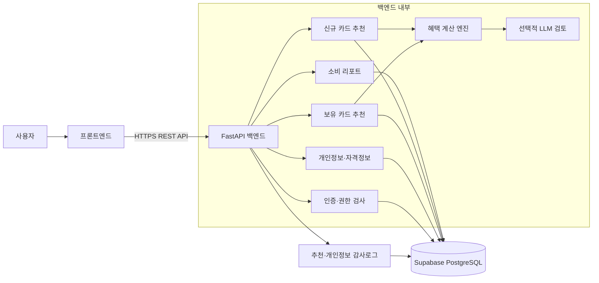
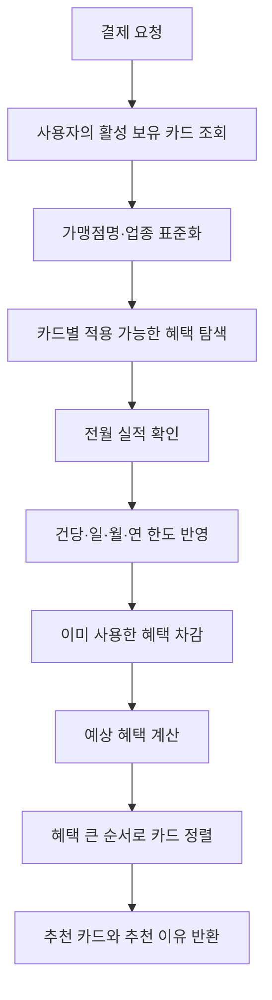

# PICKA 백엔드 최종 기술 문서

> 작성 기준일: 2026-07-25  
> 대상: PICKA 카드 추천 서비스 최종 발표 및 제출물  
> 목적: 프로젝트를 처음 접하는 사람도 시스템의 구조, 추천 원리, 데이터 처리, 보안 설계를 이해할 수 있도록 설명한다.

---

## 1. 프로젝트 한눈에 보기

PICKA는 사용자의 카드 사용 내역과 생활 정보를 분석하여 두 가지 상황에서 적절한 카드를 추천하는 서비스다.

1. **결제 직전 추천**: 사용자가 이미 보유한 카드 중 이번 결제에서 가장 큰 혜택을 받을 카드를 추천한다.
2. **신규 카드 추천**: 최근 소비 패턴과 사용자 자격 조건을 분석하여 새로 발급받을 만한 카드를 추천한다.

단순히 할인율이 높은 카드를 보여주는 것이 아니라 다음 정보를 함께 계산한다.

- 사용자가 실제로 보유한 카드인지
- 결제하려는 가맹점과 혜택 업종이 일치하는지
- 전월 실적을 충족했는지
- 건당·월간 할인 한도가 남아 있는지
- 이미 받은 혜택을 제외하고 추가 혜택이 남아 있는지
- 카드별 발급 자격과 혜택별 자격을 충족하는지
- 신규 카드가 현재 실제로 발급 가능한 상태인지
- 예상 연간 혜택에서 연회비를 뺀 순혜택이 얼마인지

---

## 2. MVP에서 현재 구조까지의 발전 과정

### 2.1 초기 MVP

초기에는 빠르게 추천 가능성을 검증하기 위해 JSON·CSV와 파이썬 딕셔너리를 사용했다. 사용자 상태와 카드 정보도 메모리에서 직접 불러왔으며 로그인, 데이터 영속성, 개인정보 보호 계층은 없었다.

이 방식은 아이디어 검증에는 빠르지만 다음 한계가 있었다.

- 서버가 재시작되면 사용자 상태를 안정적으로 유지하기 어렵다.
- 여러 사용자의 카드·거래·혜택 사용량을 분리하기 어렵다.
- 개인정보와 인증정보를 안전하게 관리할 수 없다.
- 추천 결과가 왜 나왔는지 추적하기 어렵다.
- 프론트엔드와 실제 서비스 형태로 연결하기 어렵다.

### 2.2 현재 구조

현재는 PostgreSQL 기반의 데이터 중심 구조로 전환했다.

- Supabase PostgreSQL에 사용자·카드·혜택·거래 데이터를 영구 저장
- SQLAlchemy ORM으로 애플리케이션과 DB 연결
- Alembic으로 DB 스키마 변경 이력 관리
- JWT 기반 로그인과 사용자별 접근 통제
- 개인정보 암호화와 감사로그 적용
- 카드 혜택 계산, 소비 분석, 신규 카드 추천을 서비스 계층으로 분리
- 매일 추천 캐시 생성 및 정책 버전 관리
- 총 120개의 자동화 테스트로 주요 기능 검증

발표에서는 이 변화를 다음 한 문장으로 설명할 수 있다.

> “정적 데이터로 추천 가능성을 검증한 MVP를, 실제 사용자 상태와 거래 이력을 저장하고 보안·감사·캐시까지 지원하는 DB 기반 개인화 서비스로 발전시켰습니다.”

---

## 3. 기술 스택

| 영역 | 기술 | 사용 목적 |
|---|---|---|
| API 서버 | FastAPI | REST API, 요청 검증, Swagger 문서 제공 |
| 실행 서버 | Uvicorn | ASGI 애플리케이션 실행 |
| 데이터베이스 | PostgreSQL / Supabase | 사용자·카드·혜택·거래 데이터 영구 저장 |
| ORM | SQLAlchemy 2 | 파이썬 객체와 DB 테이블 연결 |
| 마이그레이션 | Alembic | DB 스키마 버전 관리 |
| 데이터 검증 | Pydantic | API 입력값 타입·범위·조건 검증 |
| 인증 | JWT, PyJWT | Access Token과 Refresh Token 발급 |
| 비밀번호 | scrypt | 비밀번호 단방향 해시 |
| 개인정보 암호화 | AES-256-GCM | 이름·이메일·전화번호·자격정보 암호화 |
| 검색용 개인정보 처리 | HMAC-SHA256 blind index | 이메일 복호화 없이 동일 이메일 검색 |
| 선택적 AI | OpenAI API | 규칙만으로 판단하기 어려운 혜택 문구 검토 |
| 테스트 | unittest, FastAPI TestClient | API·추천·보안·DB 동작 검증 |

---

## 4. 전체 시스템 구조



### 요청 처리의 기본 원칙

1. 프론트엔드가 Bearer Access Token과 함께 API를 호출한다.
2. 백엔드는 토큰을 검증하고 요청한 `user_id`가 로그인 사용자와 같은지 확인한다.
3. DB에서 사용자 상태와 필요한 카드·혜택·거래 데이터를 읽는다.
4. 추천 또는 리포트 계산을 수행한다.
5. 민감정보를 제외한 결과만 프론트엔드에 반환한다.
6. 중요한 추천과 개인정보 변경은 감사로그에 남긴다.

---

## 5. 핵심 데이터 모델

### 5.1 사용자와 인증

| 테이블 | 역할 |
|---|---|
| `users` | 사용자 계정, 암호화된 이메일·이름, 비밀번호 해시, 역할 저장 |
| `auth_refresh_tokens` | Refresh Token의 원문이 아닌 SHA-256 해시와 폐기 상태 저장 |
| `user_persona_profiles` | 생년월일, 전화번호, 성별, 직업, 거주지, 자녀 정보 등 암호화 저장 |
| `user_eligibilities` | 카드 발급 및 혜택 적용에 필요한 사용자 자격정보 암호화 저장 |

### 5.2 카드와 혜택

| 테이블 | 역할 |
|---|---|
| `cards` | 카드명, 카드사, 카드 종류, 연회비, 전월 실적, 발급 가능 상태 저장 |
| `card_benefits` | 할인·적립 혜택과 조건, 한도, 원본 설명 저장 |
| `benefit_tiers` | 실적 구간별 혜택 조건 저장 |
| `card_eligibility_rules` | 카드 자체를 발급받기 위한 자격 규칙 저장 |
| `card_benefit_eligibility_rules` | 특정 혜택을 적용받기 위한 자격 규칙 저장 |

### 5.3 보유 카드와 거래

| 테이블 | 역할 |
|---|---|
| `user_cards` | 사용자와 보유 카드의 연결, 카드 끝 4자리, 결제 토큰 저장 |
| `monthly_card_usage` | 카드별 전월·당월 실적 및 월간 혜택 사용량 저장 |
| `benefit_usage` | 혜택별 월 사용액·사용 횟수 저장 |
| `transactions` | 승인 금액, 할인액, 최종 결제액, 가맹점, 승인 시각 저장 |
| `transaction_rewards` | 거래로 발생한 포인트·마일리지 저장 |
| `transaction_benefit_outcomes` | 거래별 혜택 판정 결과 저장 |
| `demo_payment_sessions` | 시연 결제 세션 구분 |

### 5.4 추천과 운영

| 테이블 | 역할 |
|---|---|
| `card_recommendation_snapshots` | 사용자별 일일 신규 카드 추천 결과 캐시 |
| `recommendation_audit_logs` | 추천 입력·계산·선택 결과 추적 |
| `privacy_audit_logs` | 개인정보 변경 시 값이 아닌 변경 필드명만 기록 |
| `merchant_aliases` | 가맹점 별칭, 표준 가맹점명, 업종 연결 |

---

## 6. 사용자 개인정보와 자격정보

### 6.1 회원 기본정보

회원가입 기능은 프로젝트 범위에서 제외했지만, 가입 시 다음 정보를 받았다고 가정한다.

- 이름
- 생년월일
- 전화번호
- 성별
- 직업
- 거주지

이 정보는 더보기 화면에서 조회·수정할 수 있다.

### 6.2 첫 카드 등록 전 자격정보

첫 번째 카드를 등록하기 전에 다음 정보를 모두 입력해야 한다.

- 병역 대상 여부
- 개인사업자 여부
- 경차 소유 여부
- 임신·출산·육아지원카드 대상 여부
- 기타 복지카드 대상 여부
- 차량 보유 여부
- 주 이용 교통수단
- K-패스 이용 여부
- 하이패스 이용 여부
- 이용 통신사
- 선호 항공사
- 이용 쇼핑 계열
- 멤버십 정보
- 자녀 유무, 자녀 수, 자녀 연령대

자격정보가 완성되지 않은 사용자가 첫 카드를 등록하면 백엔드는 HTTP `409`와 `QUALIFICATION_PROFILE_REQUIRED` 코드를 반환한다.

### 6.3 복수 선택 정보

복수 선택값은 암호화된 JSON 배열로 저장한다.

| 항목 | 최대 선택 수 | 예시 |
|---|---:|---|
| 주 이용 교통수단 | 2개 | `CAR`, `PUBLIC_TRANSPORT` |
| 선호 항공사 | 2개 | `KOREAN_AIR`, `ASIANA` |
| 이용 쇼핑 계열 | 3개 | `LOTTE`, `SHINSEGAE_EMART`, `COUPANG` |

과거 단일 문자열로 저장된 데이터도 읽을 때 자동으로 배열로 변환하므로 기존 데이터와 호환된다.

### 6.4 자격 규칙 연산자

| 연산자 | 의미 | 예시 |
|---|---|---|
| `EQ` | 값이 정확히 같은지 비교 | 통신사 `SKT` |
| `CONTAINS` | 배열 안에 필요한 값이 있는지 비교 | 선호 항공사에 `KOREAN_AIR` 포함 |
| `GTE` | 기준값 이상인지 비교 | 자녀 수 2명 이상 |
| `LTE` | 기준값 이하인지 비교 | 특정 연령 이하 |

선호 항공사와 쇼핑 계열은 복수 선택이므로 카드·혜택 규칙도 `CONTAINS`를 사용한다.

---

## 7. 인증과 접근 권한

### 7.1 로그인

로그인은 이메일과 비밀번호를 받는다.

1. 이메일을 정규화한다.
2. 이메일 blind index로 사용자를 검색한다.
3. scrypt로 비밀번호를 검증한다.
4. Access Token과 Refresh Token을 발급한다.

존재하지 않는 이메일도 더미 scrypt 연산을 수행한다. 따라서 이메일 존재 여부에 따른 응답 시간 차이를 줄여 사용자 계정 추측 공격을 어렵게 한다.

### 7.2 Access Token

- 기본 만료시간: 60분
- 사용자 ID, 토큰 종류, 발급·만료 시각, 고유 `jti` 포함
- 모든 사용자 전용 API에서 Bearer Token 검증
- 일반 사용자는 자신의 데이터에만 접근 가능
- 관리자는 카드 자격규칙 같은 관리자 기능에 접근 가능

Access Token은 무상태 JWT이므로 만료 전 개별 폐기는 하지 않는다. 즉시 폐기가 필요한 운영 환경에서는 `jti` 차단 목록을 추가할 수 있다.

### 7.3 Refresh Token

- 기본 만료시간: 30일
- DB에는 원문 대신 SHA-256 해시만 저장
- 재발급할 때 기존 토큰을 폐기하고 새 토큰으로 회전
- 폐기한 토큰을 다시 사용하면 해당 세션의 재사용을 차단
- 로그아웃 시 Refresh Token 폐기
- 만료 토큰과 오래된 폐기 토큰은 스케줄러가 정리

---

## 8. 개인정보 보호 설계

### 8.1 AES-256-GCM 암호화

이름, 이메일, 생년월일, 전화번호, 성별, 직업, 거주지, 자녀 정보, 멤버십, 사용자 자격정보는 AES-GCM으로 암호화한다.

AES-GCM을 사용한 이유는 다음과 같다.

- 암호문을 통해 원문을 알 수 없다.
- 암호화할 때마다 임의 nonce를 사용해 같은 값도 다른 암호문이 된다.
- 인증 태그를 통해 암호문 변조 여부를 탐지한다.
- 필드별 context를 추가 인증 데이터로 사용하여 다른 사용자나 다른 필드의 암호문으로 바꿔 끼우는 공격을 방지한다.

### 8.2 이메일 blind index

이메일을 완전히 임의 암호화하면 DB에서 같은 이메일을 검색할 수 없다. 이를 해결하기 위해 별도 키를 사용하는 HMAC-SHA256 blind index를 함께 저장한다.

```text
로그인 이메일
  ├─ AES-GCM 암호문 → 원문 보호
  └─ HMAC blind index → 동일 이메일 검색
```

암호화 키와 blind index 키는 서로 다른 키를 사용한다.

### 8.3 비밀정보 관리

실제 비밀값은 `.env`에만 저장하며 `.gitignore`로 Git 추적에서 제외한다.

- DB 접속 문자열
- JWT 비밀키
- 개인정보 암호화 키
- blind index 키
- OpenAI API 키

`.env.example`에는 변수명과 설명만 있고 실제 값은 없다.

### 8.4 로그 마스킹

로그 필터는 다음 값이 서버 로그에 그대로 남지 않도록 가린다.

- 비밀번호와 비밀번호 해시
- Access·Refresh Token
- 카드번호, CVC, 카드 비밀번호 앞 2자리
- 결제 토큰
- DB URL
- JWT·개인정보 암호화 키

### 8.5 DB 전송 구간 보호

원격 PostgreSQL 연결에는 최소 `sslmode=require`를 강제한다. 운영 환경에서는 공급자 CA 인증서를 준비한 뒤 다음 설정으로 서버 인증서와 호스트명까지 검증할 수 있다.

```env
DATABASE_SSLMODE=verify-full
DATABASE_SSLROOTCERT=/path/to/provider-ca.crt
```

---

## 9. 카드 등록과 결제 시연

### 9.1 카드 등록

카드는 직접 입력 또는 스캔 방식으로 등록할 수 있다. 두 방식은 동일한 검증·토큰화 흐름을 사용한다.

백엔드는 다음 정보를 영구 저장하지 않는다.

- 전체 카드번호
- CVC
- 카드 비밀번호 앞 2자리

저장하는 정보는 카드번호 끝 4자리와 mock vault에서 생성한 결제 토큰이다. API 응답도 마스킹된 카드번호만 반환한다.

### 9.2 현재 시연 범위

실제 카드사나 PG사의 vault가 아니라 프로젝트 시연용 mock vault를 사용한다. 입력한 민감정보는 카드 식별과 토큰 생성 과정에서만 사용하고 폐기한다.

실서비스로 전환할 때는 mock vault를 PCI DSS를 준수하는 PG·카드사 토큰화 서비스로 교체해야 한다.

### 9.3 가상 결제

가상 결제를 실행하면 다음 순서로 처리한다.

1. 사용자가 실제 보유한 활성 카드인지 확인
2. 가맹점 업종 표준화
3. 카드 혜택과 실적·한도 계산
4. 할인액을 원 결제금액 이하로 제한
5. 월간 카드 총 혜택 한도 적용
6. 가상 승인번호 생성
7. 원 결제액·할인액·최종 승인액 저장
8. 포인트·마일리지와 혜택 사용량 저장

---

## 10. 결제 직전 보유 카드 추천

### 10.1 입력

- 사용자 ID
- 가맹점명
- 결제 업종
- 결제 예정 금액
- 사용 월

### 10.2 계산 과정



### 10.3 혜택 계산에서 고려하는 조건

- 퍼센트 할인과 정액 할인
- 최소 결제금액
- 전월 실적 조건
- 건당 할인 한도
- 월 할인 한도
- 카드 전체 월간 혜택 한도
- 일·월 이용 횟수
- 옵션형 혜택과 선택 그룹
- 이미 사용한 월간 혜택
- 가맹점·업종 조건
- 계산 신뢰도 등급

혜택 계산 결과가 같거나 혜택이 없는 경우에는 당월 실적 달성에 도움이 되는 카드를 우선 제안할 수 있다. 사용자가 다른 카드를 선택하면 선택 결과도 감사로그에 남긴다.

---

## 11. 신규 카드 추천

### 11.1 추천 대상 제한

신규 카드 추천 후보는 다음 조건을 모두 만족해야 한다.

- 사용자가 아직 보유하지 않은 카드
- 요청한 신용·체크카드 종류와 일치
- `cards.is_active = true`, 즉 현재 발급 가능
- 사용자 카드 자격규칙 충족
- 사용자에게 적용할 수 있는 혜택 존재

2026-07-25 기준 카드 DB 1,559개를 발급 상태와 동기화했으며, 명확한 현재 발급 신호가 확인된 139개만 신규 추천 후보로 활성화했다. 발급중단 또는 발급 여부가 불명확한 카드는 보유 카드 기록에서는 유지하되 신규 추천에서는 제외한다.

### 11.2 소비 패턴 분석

최근 90일 거래를 세 구간으로 나누어 최신 소비에 더 큰 가중치를 준다.

| 기간 | 가중치 |
|---|---:|
| 최근 30일 | 50% |
| 31~60일 | 30% |
| 61~90일 | 20% |

단순 결제금액만 사용하지 않고 소비 빈도도 함께 본다. 빈도 차이가 비슷할 때는 결제금액이 큰 업종을 우선한다.

### 11.3 가맹점 별칭 처리

같은 가맹점이 여러 이름으로 기록될 수 있다.

예를 들어 `스타벅스 강남점`, `STARBUCKS`, `스타벅스 앱`을 표준 가맹점명과 업종으로 연결한다. 이를 통해 혜택 설명에 특정 가맹점명이 있을 때 실제 거래와 매칭할 수 있다.

### 11.4 예상 순혜택

카드별로 최근 소비 패턴에 혜택을 적용하고 월 예상 혜택을 계산한다.

```text
예상 연간 순혜택 = 월 예상 혜택 × 12 - 연회비
```

연회비는 1년에 한 번 차감한다. 현재는 국내전용·해외겸용 등 브랜드별 연회비 중 DB에 저장된 최소 연회비를 사용한다.

### 11.5 자격정보 반영

다음과 같은 제휴·정책 카드는 사용자 자격정보와 연결한다.

- 병역·나라사랑카드
- 학생·청소년 카드
- 개인사업자 카드
- 경차·차량·하이패스 카드
- K-패스 카드
- 임신·출산·육아지원카드
- 다자녀 카드
- 통신사 제휴카드
- 대한항공·아시아나 등 항공사 제휴카드
- 롯데·신세계·이마트·현대백화점·쿠팡 쇼핑 제휴카드
- 멤버십 전용 혜택

자격이 없으면 카드를 제외하고, 정보가 없으면 확인이 필요한 카드로 구분한다.

### 11.6 일일 추천 캐시

신규 추천 계산은 사용자별로 하루 한 번 생성해 snapshot에 저장한다.

- 기준 시간대: Asia/Seoul
- 매일 자정 자동 갱신
- 서버 시작 시 누락된 당일 캐시 생성
- PostgreSQL advisory lock으로 여러 서버가 동시에 중복 생성하는 문제 방지
- 추천 정책 버전이 바뀌면 기존 캐시 자동 재생성
- 개인정보·자격정보 변경 시 해당 사용자 캐시 삭제
- 캐시 응답 시에도 카드 발급 가능 상태와 자격을 다시 검사

마지막 재검사가 중요한 이유는 아침에 캐시를 만든 뒤 카드가 발급중단되더라도 당일 추천에 계속 노출되지 않게 하기 위해서다.

---

## 12. 선택적 LLM 사용 원칙

핵심 할인 계산은 규칙 기반 코드가 수행한다. LLM이 할인액을 임의로 계산하거나 추천 순위를 직접 결정하지 않는다.

LLM은 다음처럼 문구가 모호한 경우에만 보조적으로 사용한다.

- 특정 가맹점 범위가 불명확한 조건
- 제외 조건이 여러 문장에 흩어진 경우
- 규칙 파싱 신뢰도가 낮고 추가 검토가 필요한 경우

LLM 호출에 실패하면 서비스 전체가 중단되지 않도록 안전한 기본 판정으로 계속 진행한다. 동일한 모호 조건은 캐시하여 반복 호출도 줄인다.

---

## 13. 소비 리포트

월별 소비 리포트는 승인된 거래를 기준으로 생성한다.

- 월 총 소비금액
- 업종별 소비금액과 비중
- 일자별 누적 소비
- 카드별 사용액
- 실제 받은 할인·적립 혜택
- 전월 대비 비교에 필요한 데이터

결제 원본 업종과 사용자에게 보여줄 리포트 업종을 분리하여, 카드 혜택 계산의 정확성과 화면 가독성을 함께 유지한다.

---

## 14. 주요 API

모든 사용자 전용 API는 `Authorization: Bearer <access_token>` 헤더가 필요하다.

### 14.1 인증

| Method | Path | 기능 |
|---|---|---|
| POST | `/api/v1/auth/login` | 이메일·비밀번호 로그인 |
| POST | `/api/v1/auth/refresh` | Access·Refresh Token 회전 |
| POST | `/api/v1/auth/logout` | Refresh Token 폐기 |

### 14.2 개인정보와 자격정보

| Method | Path | 기능 |
|---|---|---|
| GET | `/api/v1/users/{user_id}/personal-profile` | 기본 개인정보 조회 |
| PATCH | `/api/v1/users/{user_id}/personal-profile` | 기본 개인정보 부분 수정 |
| GET | `/api/v1/users/{user_id}/qualification-profile` | 개인정보와 전체 자격정보 통합 조회 |
| PUT | `/api/v1/users/{user_id}/qualification-profile` | 첫 카드 등록 전 자격정보 전체 입력 |
| PATCH | `/api/v1/users/{user_id}/qualification-profile` | 더보기 화면에서 일부 정보 수정 |
| GET | `/api/v1/users/{user_id}/eligibilities` | 원시 자격정보 목록 조회 |
| PUT | `/api/v1/users/{user_id}/eligibilities` | 자격정보 갱신 |

### 14.3 보유 카드와 거래

| Method | Path | 기능 |
|---|---|---|
| GET | `/api/v1/users/{user_id}/cards` | 활성 보유 카드 목록과 월 상태 조회 |
| POST | `/api/v1/users/{user_id}/cards/manual` | 카드 직접 입력 등록 |
| POST | `/api/v1/users/{user_id}/cards/scan` | 카드 스캔 결과 등록 |
| GET | `/api/v1/users/{user_id}/cards/{card_id}` | 보유 카드 상세 조회 |
| DELETE | `/api/v1/users/{user_id}/cards/{card_id}` | 보유 카드 소프트 삭제 |
| POST | `/api/v1/transactions` | 가상 결제 승인 및 혜택 저장 |
| GET | `/api/v1/users/{user_id}/cards/{card_id}/transactions` | 카드별 거래내역 조회·페이지네이션 |

### 14.4 추천과 리포트

| Method | Path | 기능 |
|---|---|---|
| POST | `/api/v1/recommendations` | 보유 카드 중 결제 카드 추천 |
| POST | `/api/v1/recommendations/select` | 사용자가 직접 선택한 카드 결과 계산 |
| GET | `/api/v1/users/{user_id}/card-recommendations` | 소비 패턴 기반 신규 카드 추천 |
| GET | `/api/v1/users/{user_id}/spending-report` | 월별 소비 리포트 조회 |

### 14.5 관리자 자격규칙

| Method | Path | 기능 |
|---|---|---|
| GET | `/api/v1/cards/{card_id}/eligibility-rules` | 카드 발급 자격규칙 조회 |
| PUT | `/api/v1/cards/{card_id}/eligibility-rules` | 카드 발급 자격규칙 교체, 관리자 전용 |

Swagger 문서는 서버 실행 후 `http://localhost:8000/docs`에서 확인할 수 있다.

---

## 15. 감사로그와 데이터 보존

### 추천 감사로그

다음 요청의 입력, 계산 결과, 선택 카드, 정책 버전, 캐시 사용 여부를 기록한다.

- 보유 카드 결제 추천
- 사용자의 카드 직접 선택
- 신규 카드 추천

추천 결과가 예상과 다를 때 “어떤 입력과 정책으로 이 결과가 나왔는가”를 확인할 수 있다.

### 개인정보 감사로그

개인정보를 수정하면 변경된 필드명만 기록한다.

예: `phone_number`, `qualification.MOBILE_CARRIER`

전화번호나 이름 같은 실제 값은 감사로그에 저장하지 않는다.

### 보존 기간

- 개인정보 변경 감사로그: 90일
- 추천 감사로그: 90일
- 폐기된 Refresh Token: 폐기 후 7일 보존 뒤 정리
- 만료 Refresh Token: 자동 정리

---

## 16. 카드 발급중단 관리

카드 원본 사이트는 과거 카드 상세 페이지도 보관하므로 “페이지가 존재한다”는 사실만으로 현재 발급 가능하다고 판단할 수 없다.

이를 해결하기 위해 발급 상태 동기화 스크립트를 만들었다.

```powershell
python -m scripts.sync_card_issuance_status --apply --workers 16
```

이 스크립트는 현재 온라인 신청 또는 활성 발급 이벤트 같은 명확한 발급 신호를 확인하고 `cards.is_active`를 갱신한다. 조회 실패 카드는 임의로 상태를 바꾸지 않는다. 상태가 변경되면 기존 신규 추천 캐시도 삭제한다.

신규 추천 쿼리와 캐시 반환 경로 모두 `is_active = true`를 검사하므로 발급중단 카드는 추천되지 않는다.

---

## 17. 테스트 전략과 결과

최종 기준 자동화 테스트는 총 **120개**다.

### 테스트 범위

- 카드 혜택 퍼센트·정액 계산
- 전월 실적과 월간 한도
- 옵션형 혜택과 계산 신뢰도 등급
- 가맹점 별칭과 업종 보정
- 보유 카드 추천과 동점 처리
- 신규 카드 소비 패턴 추천
- 발급중단 카드와 캐시 재검사
- 카드·혜택 자격규칙
- 복수 항공사·쇼핑 계열 JSON 배열
- 거래 승인, 할인액, 포인트·마일리지
- 거래내역 권한·필터·페이지네이션
- 로그인, 토큰 회전, 재사용 차단, 로그아웃
- 개인정보 암호화와 context 바인딩
- 로그 민감정보 마스킹
- DB SSL 설정
- 개인정보 변경 감사로그
- 월별 소비 리포트

### 실행 명령

```powershell
python -m unittest discover -s tests -q
```

최종 실행 결과:

```text
Ran 120 tests
OK
```

---

## 18. 로컬 실행 방법

### 18.1 가상환경과 패키지

```powershell
python -m venv .venv
.\.venv\Scripts\Activate.ps1
pip install -r requirements.txt
```

### 18.2 환경변수

`.env.example`을 참고해 `.env`를 작성한다. 실제 키는 Git에 커밋하지 않는다.

```env
DATABASE_URL=postgresql+psycopg://...
DATABASE_SSLMODE=require
DATABASE_SSLROOTCERT=

JWT_SECRET_KEY=
JWT_ALGORITHM=HS256
ACCESS_TOKEN_EXPIRE_MINUTES=60
REFRESH_TOKEN_EXPIRE_DAYS=30

PII_ENCRYPTION_KEY=
PII_BLIND_INDEX_KEY=

OPENAI_API_KEY=
OPENAI_MODEL=
```

개인정보 암호화 키는 URL-safe base64로 인코딩한 32바이트 키여야 한다. blind index 키는 별도로 생성한다.

### 18.3 DB 마이그레이션

```powershell
alembic upgrade head
```

### 18.4 서버 실행

```powershell
python -m uvicorn app.main:app --reload
```

- API 서버: `http://localhost:8000`
- Swagger: `http://localhost:8000/docs`
- 상태 확인: `GET http://localhost:8000/health`

---

## 19. 운영 시 확인할 사항

현재 프로젝트는 최종 발표와 기능 시연에 필요한 백엔드 기능을 갖추고 있다. 실제 상용 서비스로 확장할 때는 다음 작업이 추가로 필요하다.

1. 실제 서비스 도메인을 CORS 허용 목록에 등록
2. HTTPS를 적용한 reverse proxy 또는 클라우드 gateway 구성
3. 공급자 CA 인증서와 `verify-full` DB 연결 적용
4. `.env` 대신 클라우드 Secret Manager 사용
5. 로그인 rate limit과 반복 실패 계정 보호
6. Access Token 즉시 폐기가 필요하면 `jti` 차단 목록 추가
7. mock card vault를 실제 PG 토큰화 서비스로 교체
8. 카드 국내·해외 브랜드별 연회비 분리
9. 카드 발급 상태 정기 동기화 자동화
10. 의존성 취약점 검사와 CI 보안 테스트 추가

---

## 20. 발표 시 강조할 기술적 차별점

### 1. 단순 할인율 비교가 아닌 실제 상태 기반 계산

전월 실적, 남은 한도, 이미 사용한 혜택, 옵션형 조건까지 반영한다.

### 2. 두 종류의 추천을 분리

결제 직전에는 보유 카드 중 최적 카드를, 장기적으로는 소비 패턴에 맞는 신규 카드를 추천한다.

### 3. 사용자 자격정보를 카드와 혜택에 연결

병역·육아·차량·통신사·항공사·쇼핑 계열 같은 조건을 DB 규칙으로 관리한다.

### 4. 최신 소비를 더 중요하게 분석

최근 90일 소비에 50%·30%·20% 가중치를 적용해 변화한 소비 습관을 반영한다.

### 5. 발급중단 카드의 재노출 방지

DB 상태, 신규 추천 쿼리, 캐시 응답의 세 단계에서 발급 가능 상태를 확인한다.

### 6. 개인정보 보호를 기능 설계에 포함

AES-GCM 암호화, blind index, scrypt, Refresh Token 해시, 로그 마스킹, 감사로그를 적용했다.

### 7. 설명 가능한 추천

추천 입력과 계산 결과를 감사로그로 남기고, API는 예상 혜택과 추천 이유를 함께 반환한다.

---

## 21. 결론

PICKA 백엔드는 초기 정적 데이터 MVP에서 출발해 다음을 갖춘 개인화 카드 추천 백엔드로 발전했다.

- 실제 DB 기반 사용자·카드·거래 상태 관리
- 결제 직전 보유 카드 추천
- 소비 패턴 기반 신규 카드 추천
- 카드·혜택 자격규칙
- 거래와 소비 리포트
- JWT 인증과 사용자별 권한 분리
- 개인정보 암호화와 감사로그
- 발급중단 카드 관리와 일일 추천 캐시
- 자동화 테스트를 통한 안정성 검증

핵심 가치는 “혜택이 커 보이는 카드”가 아니라 **현재 사용자의 실제 소비, 자격, 실적, 한도, 발급 가능 상태를 반영한 카드**를 추천하는 데 있다.
