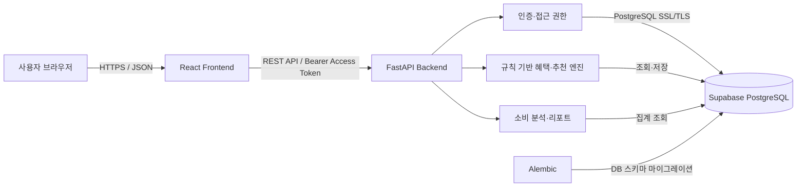

# PICKA Backend

사용자의 보유 카드, 소비 이력, 전월 실적, 남은 혜택 한도와 자격정보를 분석하여 결제 상황에 적합한 카드와 신규 카드를 추천하는 PICKA 서비스의 백엔드입니다.

PICKA는 단순히 할인율이 높은 카드를 나열하지 않습니다. 사용자가 실제로 받을 수 있는 혜택을 계산하기 위해 가맹점과 업종, 전월 실적, 최소 결제금액, 건당·일·월 한도, 이미 사용한 혜택과 카드 발급 자격을 함께 반영합니다.

## 주요 기능

### 결제 직전 보유 카드 추천

- 사용자의 활성 보유 카드만 추천 후보로 조회
- 가맹점 별칭과 결제 카테고리 표준화
- 전월 실적, 최소 결제금액과 혜택 한도 반영
- 카드별 예상 할인·적립액 계산
- 예상 혜택과 추천 이유 제공

### 소비 패턴 기반 신규 카드 추천

- 최근 90일 소비 분석
- 최근 소비에 50%·30%·20% 구간 가중치 적용
- 미보유 카드와 현재 발급 가능한 카드만 추천
- 카드 발급 자격과 혜택별 자격 확인
- 예상 연간 혜택에서 연회비를 차감한 순혜택 계산
- 사용자별 일일 추천 결과 캐시

### 카드·거래 관리

- 카드 직접 입력 및 스캔 결과 등록
- 사용자별 보유 카드와 월간 사용 상태 조회
- 카드별 거래내역 조회 및 페이지네이션
- 실제 금융망과 분리된 가상 결제 승인
- 할인, 포인트와 마일리지 결과 저장
- 테스트 거래를 `DEMO`로 구분하여 사용자 통계에서 제외

### 소비리포트

- 월 총소비와 전월 대비 증감
- 일자별 누적 소비
- 카테고리별 소비금액과 비중
- 카드별 확정 혜택
- 포인트·마일리지 요약

### 인증·개인정보 보호

- JWT Access·Refresh Token 인증
- Refresh Token 회전 및 재사용 방지
- 사용자별 데이터 접근 권한 확인
- scrypt 비밀번호 단방향 해시
- AES-256-GCM 개인정보 암호화
- HMAC-SHA256 이메일 blind index
- 민감정보 로그 마스킹과 개인정보 변경 감사로그

## 시스템 구조



- 프론트엔드와 백엔드는 Render에 배포합니다.
- 운영 데이터는 Supabase의 관리형 PostgreSQL에 저장합니다.
- 브라우저와 백엔드 사이는 HTTPS/TLS, 백엔드와 DB 사이는 PostgreSQL SSL/TLS로 보호합니다.

## 기술 스택

| 영역 | 기술 | 역할 |
|---|---|---|
| API | FastAPI | REST API, 의존성 주입, OpenAPI 문서 |
| 서버 | Uvicorn | ASGI 애플리케이션 실행 |
| 검증 | Pydantic | 요청·응답 타입 및 조건 검증 |
| 데이터베이스 | PostgreSQL / Supabase | 관계형 서비스 데이터 영구 저장 |
| ORM | SQLAlchemy 2 | Python 모델과 데이터베이스 연결 |
| 마이그레이션 | Alembic | DB 스키마 변경 이력 관리 |
| 인증 | JWT / PyJWT | Access·Refresh Token 발급 및 검증 |
| 비밀번호 | scrypt | salt 기반 단방향 해시 |
| 개인정보 | AES-256-GCM | 개인정보 암호화 및 위변조 검증 |
| 검색 | HMAC-SHA256 | 이메일 blind index 생성 |
| 배포 | Render | 프론트엔드·백엔드 배포 |

## 추천 처리 흐름

### 결제 직전 추천

```text
가맹점·결제금액 입력
        ↓
사용자의 활성 보유 카드 조회
        ↓
가맹점 별칭·결제 카테고리 표준화
        ↓
카드별 적용 가능한 혜택 검색
        ↓
전월 실적·최소금액·남은 한도 확인
        ↓
예상 혜택 계산 및 정렬
        ↓
추천 카드·예상 혜택·추천 이유 반환
```

### 신규 카드 추천

```text
최근 90일 승인 거래 조회
        ↓
카테고리별 금액·빈도 분석
        ↓
미보유·발급 가능 카드 필터링
        ↓
사용자 및 혜택 자격 검사
        ↓
월 예상 혜택 계산
        ↓
예상 연간 순혜택 = 월 혜택 × 12 - 연회비
        ↓
상위 추천 결과 저장 및 반환
```

추천 금액과 순위는 생성형 AI가 아닌 규칙 기반 코드가 계산합니다. 같은 입력에 같은 결과를 제공하고, 계산 근거를 테스트하고 추적할 수 있도록 하기 위한 설계입니다.

## 데이터 파이프라인

```text
카드 상세 페이지의 상품·혜택 원문 수집
        ↓
카드명·연회비·혜택 조건 정제
        ↓
중복·결측치 검토 및 카테고리 표준화
        ↓
CSV·JSON 형태로 구조화
        ↓
Supabase PostgreSQL 적재
        ↓
추천 엔진에서 카드·혜택 조건 조회
```

원본의 비정형 혜택 문구를 할인율, 정액 혜택, 실적 조건, 적용 업종과 각종 한도처럼 계산 가능한 정형 데이터로 변환합니다.

## 핵심 데이터 모델

| 테이블 | 역할 |
|---|---|
| `users` | 사용자 계정, 역할, 암호화 개인정보 |
| `auth_refresh_tokens` | Refresh Token 해시, 만료·폐기 상태 |
| `user_persona_profiles` | 사용자 생활·인구통계 프로필 |
| `user_eligibilities` | 카드 발급 및 혜택 자격정보 |
| `cards` | 카드 상품, 연회비, 전월 실적, 발급 상태 |
| `card_benefits` | 할인·적립 혜택과 조건·한도 |
| `benefit_tiers` | 전월 실적 구간별 혜택 정보 |
| `user_cards` | 사용자와 보유 카드의 관계 |
| `monthly_card_usage` | 카드별 월간 사용 상태 |
| `benefit_usage` | 혜택별 월 사용액·횟수 |
| `benefit_daily_usage` | 혜택별 일 사용액·횟수 |
| `transactions` | 승인 거래, 결제금액과 확정 혜택 |
| `transaction_rewards` | 포인트·마일리지 결과 |
| `merchant_aliases` | 가맹점 별칭과 표준 카테고리 |
| `card_recommendation_snapshots` | 사용자별 일일 신규 카드 추천 캐시 |
| `recommendation_audit_logs` | 추천 입력·결과·정책 버전 추적 |
| `privacy_audit_logs` | 개인정보 변경 필드 감사기록 |

## 보안 설계

### 로그인과 토큰

1. 이메일과 비밀번호를 HTTPS로 전달합니다.
2. HMAC-SHA256 이메일 blind index로 사용자를 검색합니다.
3. scrypt 해시로 비밀번호를 검증합니다.
4. Access Token과 Refresh Token을 JWT 형식으로 발급합니다.
5. Access Token은 보호된 API 요청에 사용합니다.
6. Access Token 만료 시 Refresh Token을 회전하여 두 토큰을 새로 발급합니다.

기본 유효기간은 Access Token 60분, Refresh Token 30일입니다. Refresh Token 원문은 DB에 저장하지 않고 SHA-256 해시만 저장합니다.

### 개인정보

- 이름, 이메일, 전화번호와 자격정보는 AES-256-GCM으로 암호화합니다.
- 이메일 검색에는 별도 HMAC-SHA256 키로 생성한 blind index를 사용합니다.
- 비밀번호는 복호화 가능한 암호화가 아니라 scrypt 해시로 저장합니다.
- 개인정보 변경 감사로그에는 실제 값이 아닌 변경 필드명만 기록합니다.

### 접근 통제

- 보호된 API에서 Bearer Access Token을 검증합니다.
- 로그인 사용자와 요청 대상 사용자가 같은지 확인합니다.
- 다른 사용자의 데이터 요청은 `403 Forbidden`으로 거부합니다.
- 카드 자격규칙 변경은 관리자 역할만 허용합니다.

## 주요 API

모든 사용자 전용 API는 다음 헤더가 필요합니다.

```http
Authorization: Bearer <access_token>
```

### 인증

| Method | Endpoint | 설명 |
|---|---|---|
| POST | `/api/v1/auth/login` | 이메일·비밀번호 로그인 |
| POST | `/api/v1/auth/refresh` | Access·Refresh Token 회전 |
| POST | `/api/v1/auth/logout` | Refresh Token 폐기 |

### 개인정보·자격정보

| Method | Endpoint | 설명 |
|---|---|---|
| GET | `/api/v1/users/{user_id}/personal-profile` | 개인정보 조회 |
| PATCH | `/api/v1/users/{user_id}/personal-profile` | 개인정보 부분 수정 |
| GET | `/api/v1/users/{user_id}/qualification-profile` | 통합 자격 프로필 조회 |
| PUT | `/api/v1/users/{user_id}/qualification-profile` | 자격 프로필 전체 입력·교체 |
| PATCH | `/api/v1/users/{user_id}/qualification-profile` | 자격 프로필 부분 수정 |
| GET | `/api/v1/users/{user_id}/eligibilities` | 사용자 자격정보 조회 |
| PUT | `/api/v1/users/{user_id}/eligibilities` | 사용자 자격정보 교체 |

### 카드·거래

| Method | Endpoint | 설명 |
|---|---|---|
| GET | `/api/v1/users/{user_id}/cards` | 활성 보유 카드와 월 상태 조회 |
| POST | `/api/v1/users/{user_id}/cards/manual` | 카드 직접 입력 등록 |
| POST | `/api/v1/users/{user_id}/cards/scan` | 카드 스캔 결과 등록 |
| GET | `/api/v1/users/{user_id}/cards/{card_id}` | 보유 카드 상세 조회 |
| DELETE | `/api/v1/users/{user_id}/cards/{card_id}` | 보유 카드 비활성화 |
| POST | `/api/v1/transactions` | 가상 결제 승인 |
| GET | `/api/v1/users/{user_id}/cards/{card_id}/transactions` | 카드별 거래내역 조회 |

### 추천·리포트

| Method | Endpoint | 설명 |
|---|---|---|
| POST | `/api/v1/recommendations` | 결제 직전 보유 카드 추천 |
| POST | `/api/v1/recommendations/select` | 사용자 선택 카드 결과 계산 |
| GET | `/api/v1/users/{user_id}/card-recommendations` | 소비 패턴 기반 신규 카드 추천 |
| GET | `/api/v1/users/{user_id}/spending-report` | 월별 소비리포트 조회 |

API 서버 실행 후 전체 명세는 Swagger UI에서 확인할 수 있습니다.

```text
http://localhost:8000/docs
```

## 프로젝트 구조

```text
picka-backend/
├─ app/
│  ├─ api/                 # API 모듈
│  ├─ core/                # 환경설정·DB 연결
│  ├─ models/              # SQLAlchemy 모델
│  ├─ repositories/        # 데이터 접근 계층
│  ├─ schemas/             # Pydantic 응답 모델
│  ├─ services/            # 추천·인증·암호화·리포트 로직
│  └─ main.py              # FastAPI 앱과 주요 엔드포인트
├─ alembic/
│  └─ versions/            # DB 마이그레이션 이력
├─ data/                   # 정제된 카드·혜택 데이터
├─ docs/                   # 기술문서와 발표 참고자료
├─ scripts/                # 데이터 적재·정합성·운영 스크립트
├─ tests/                  # 자동화 테스트
├─ .env.example            # 환경변수 예시
├─ alembic.ini             # Alembic 설정
├─ requirements.txt        # Python 의존성
└─ README.md
```

## 로컬 실행

### 1. 저장소 이동

```powershell
cd C:\myenv\myKDA4\1st.project\picka-backend
```

### 2. 가상환경 생성 및 활성화

```powershell
python -m venv .venv
.\.venv\Scripts\Activate.ps1
```

### 3. 패키지 설치

```powershell
pip install -r requirements.txt
```

### 4. 환경변수 설정

`.env.example`을 복사하여 `.env`를 만들고 실제 값을 입력합니다.

```powershell
Copy-Item .env.example .env
```

```env
DATABASE_URL=postgresql+psycopg://...
DATABASE_SSLMODE=require
DATABASE_SSLROOTCERT=

JWT_SECRET_KEY=
JWT_ALGORITHM=HS256
ACCESS_TOKEN_EXPIRE_MINUTES=60
REFRESH_TOKEN_EXPIRE_DAYS=30

PII_ENCRYPTION_KEY=
PII_BLIND_INDEX_KEY=
RECOMMENDATION_DEBUG=false
```

실제 `.env`와 비밀키는 Git에 커밋하지 않습니다.

### 5. DB 마이그레이션

```powershell
alembic upgrade head
```

### 6. 서버 실행

```powershell
python -m uvicorn app.main:app --reload
```

| 주소 | 용도 |
|---|---|
| `http://localhost:8000` | API 서버 |
| `http://localhost:8000/docs` | Swagger UI |
| `http://localhost:8000/health` | 서버 상태 확인 |

## 테스트

전체 테스트 실행:

```powershell
python -m unittest discover -s tests -q
```

테스트 범위:

- 퍼센트·정액 혜택 계산
- 전월 실적과 각종 한도
- 가맹점 별칭과 카테고리 표준화
- 보유 카드 및 신규 카드 추천 정책
- 사용자·카드·혜택 자격규칙
- 가상 결제, 리워드와 소비리포트
- JWT 로그인, 토큰 회전과 로그아웃
- 사용자별 접근 권한
- 개인정보 암호화와 민감정보 로그 필터
- DB 연결 보안과 데모 데이터 분리

## 배포

1. 기능 브랜치에 변경사항을 커밋하고 GitHub에 push합니다.
2. Pull Request를 통해 `main` 브랜치에 병합합니다.
3. Render 백엔드 서비스에서 최신 `main` 커밋을 배포합니다.
4. DB 구조 변경이 있다면 Alembic 마이그레이션을 적용합니다.
5. `/health`와 주요 API를 확인합니다.

같은 Render 서비스를 재배포하면 기존 서비스 URL은 유지됩니다.

## 현재 범위와 한계

- 결제는 실제 카드사·PG와 연결되지 않은 가상 승인입니다.
- 추천 금액은 현재 카드 정책과 사용자 데이터에 따른 예상값이며 실제 혜택을 보장하지 않습니다.
- 카드 상품과 혜택 데이터의 최신성은 데이터 수집·검수 주기에 영향을 받습니다.
- 완전한 결제 취소·부분취소·정산 기능은 현재 범위에 포함되지 않습니다.
- 내부 스레드 기반 일일 스케줄러는 상용화 시 외부 작업 스케줄러로 분리할 필요가 있습니다.
- Access Token의 즉시 폐기가 필요하면 `jti` 차단 목록 같은 추가 장치가 필요합니다.

## 향후 개선 방향

- 실제 카드 vault와 PG 연동
- 결제 멱등키 및 취소·보상 트랜잭션
- 카드사 공식 데이터 정기 동기화
- 로그인 rate limit과 이상 로그인 탐지
- Secret Manager 기반 비밀키 관리 및 키 회전
- Redis·작업 큐를 활용한 추천 계산 확장
- 운영 모니터링, 장애 알림과 성능 부하 테스트
- 추천 선택률·실제 절약액 기반 품질 평가

## 프로젝트 핵심 가치

PICKA는 “혜택이 커 보이는 카드”가 아니라 사용자의 실제 소비, 보유 카드, 자격, 전월 실적, 남은 한도와 카드 발급 상태를 함께 고려한 카드를 추천합니다. 규칙 기반 계산과 감사기록을 통해 추천 결과의 근거를 설명하고 추적할 수 있도록 설계했습니다.
